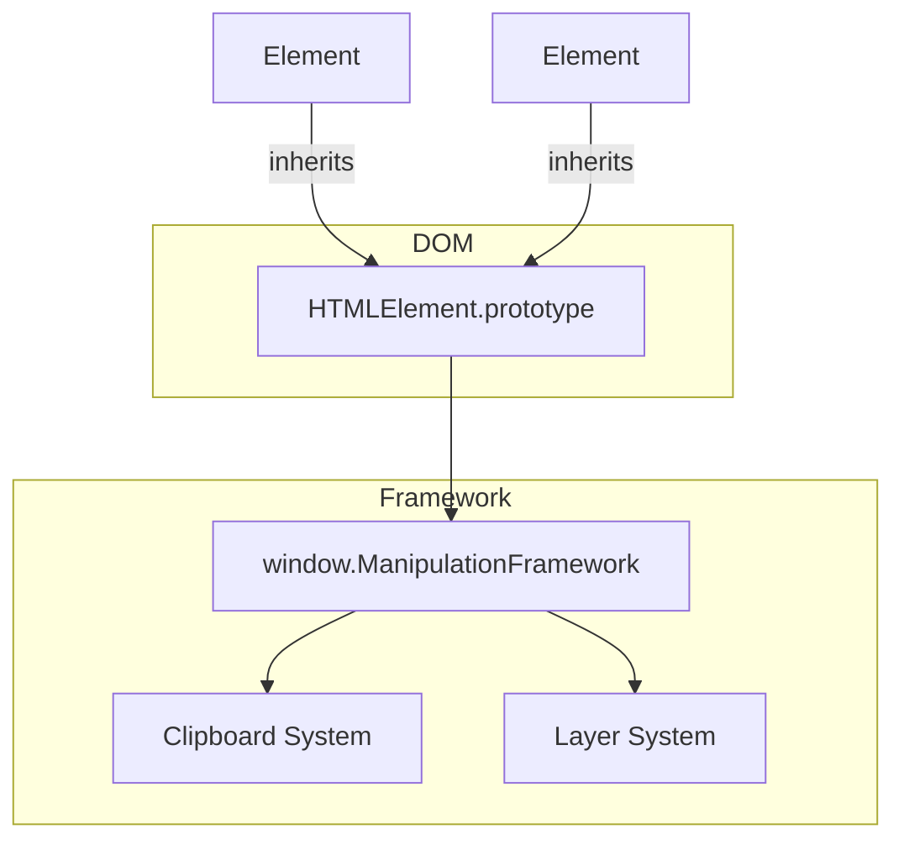

# System Patterns

## System Architecture
The framework is built as a native enhancement to the browser's DOM. Instead of a standalone library, it extends `HTMLElement.prototype`, allowing all DOM elements to automatically inherit manipulation and event handling capabilities.

### Layered Structure
The framework operates with three distinct layers:
- **Document**: The base layer.
- **Template**: Reusable UI structures.
- **Page**: Specific instance data and layout.

In manipulation mode, only the active layer is visible and selectable. In normal mode, elements from all layers are rendered together.

## Key Technical Decisions
- **Prototypal Inheritance**: Direct extension of `HTMLElement.prototype` for seamless integration.
- **ECMAScript Property Descriptors**: Use of `Object.defineProperty` to implement read-only `uid` and validated `name` properties on DOM elements.
- **Serialization for Clipboard**: A custom serialization system captures element state (attributes, styles, innerHTML, event handlers, and custom properties) to enable cross-layer cut/copy/paste.
- **Event Delegation & Chaining**: Event propagation follows a specific hierarchy: Element -> Layer Element -> Next Layer's Layer Element -> Document.

## Design Patterns in Use
- **Global State Manager**: `window.ManipulationFramework` maintains the current active layer, selection set, and clipboard state.
- **Command/Action Pattern**: Manipulation actions (move, resize, duplicate) are triggered by mouse events combined with modifier keys.
- **Intermediary Pattern**: Non-visible "layer elements" serve as catch-all event handlers for their respective layers.

## Component Relationships

